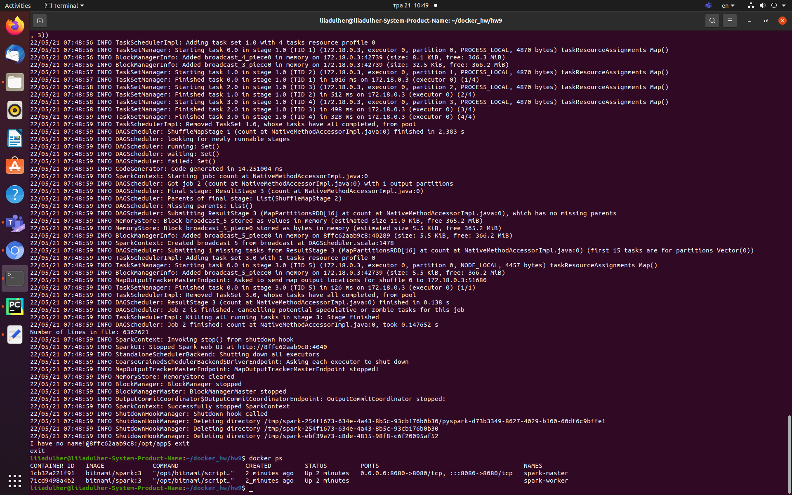

# Docker hw9
Spark

## Team: [Liia_Dulher](https://github.com/LiiaDulher)

### Prerequiments
Please put file <b>PS_20174392719_1491204439457_log.csv</b> in this directory.<br>

### Usage
````
$ sudo chmod +x shutdown-spark.sh
````
````
$ docker-compose up -d
$ ./run-program.sh
# use inside-container commands
$ ./shutdown-spark.sh
````
Inside container:
````
cd /opt/app
spark-submit --master spark://spark-master:7077 --deploy-mode client spark_transactions.py
exit
````
### Result
Number of lines in file: 6362621.

